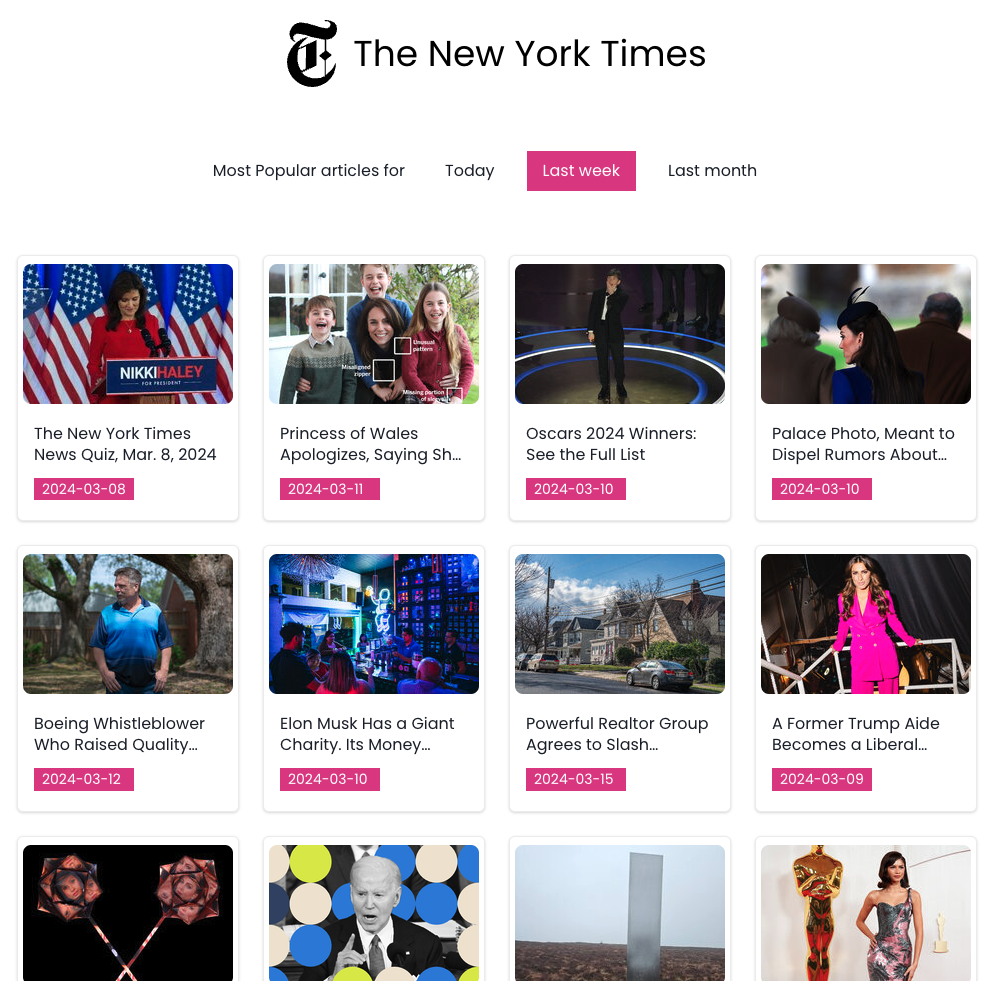
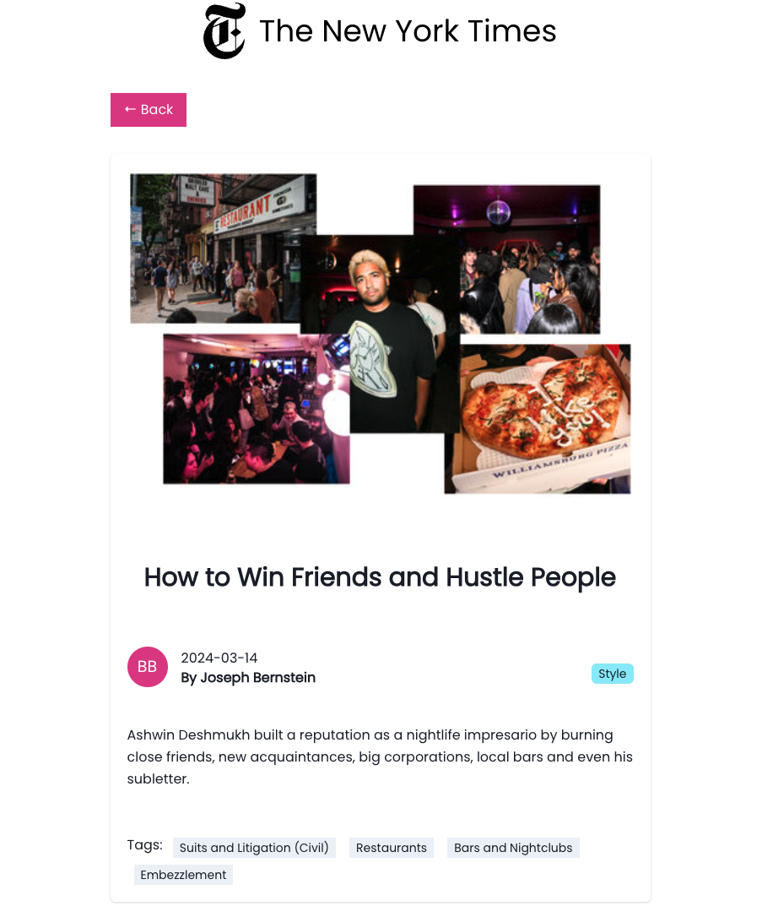

# NY Times Most Popular Articles
## # Application Overview

The NY Times Most Popular Articles is a web application that connects to the New York Times API to fetch and display a list of the most popular articles. Users can view a summary of the articles in a articles list and click on any article card to see more detailed information in a detail view.

### # Features

- **Article Listing:** Displays a list of the most viewed articles from the New York Times, based on the selected time period (1, 7, or 30 days).
- **Detail View:** Users can click on any article in the list to view detailed information, including the title, author, publish date, and a summary of the article.
- **API Integration:** Utilizes the New York Times Most Popular Articles API to retrieve article data.
- **Modern UI:** Designed with a modern UI, leveraging React and Chakra UI for a smooth user experience.

The app is built with Vite React, showcasing best practices in software development.

### # Prototype


### # Screenshots






## # Installation
Clone the repository and install dependencies:

```bash
git clone https://github.com/yourusername/ny-times-most-popular.git
cd ny-times-most-popular
yarn install
```

## # Usage

Start the development server:
```bash
yarn dev
```

Build the app for production:
```bash
yarn build
```

## # Testing and Linting
Run unit tests:
```bash
yarn test
```

Generate test coverage reports:
```bash
yarn test:coverage
```

Perform UI testing with Playwright:
```bash
yarn test-ui
```

Lint the codebase:
```bash
yarn lint
```

Automatically fix linting issues:
```bash
yarn lint:fix
```
## # Continuous Integration
Uses Husky to manage pre-commit hooks, ensuring code quality and testing before commits.
